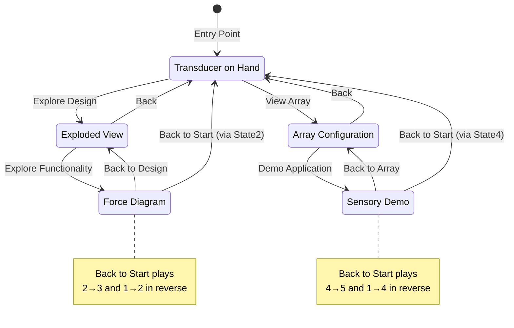

# Interactive Scientific Communication Platform - Product Requirements Document

## Product Vision
Create an interactive web-based storytelling platform that transforms static scientific publications into immersive, navigable experiences that demonstrate research impact and technical sophistication to key academic stakeholders.

## Target Outcomes
1. **Talent Attraction**: 40% increase in qualified graduate student inquiries
2. **Academic Recognition**: Enhanced grant application success through demonstrated communication excellence
3. **Research Impact**: Increased citation rates and conference presentation invitations
4. **Industry Interest**: Attract potential industry collaboration opportunities

## Core User Personas

### Primary: Prospective Graduate Students
- Evaluating research groups
- Seeking cutting-edge, well-funded projects
- Value clear communication and innovative presentation

### Secondary: Grant Review Panels
- Assessing research quality and potential impact
- Limited time to understand complex technical work
- Impressed by clear, professional communication

### Tertiary: Academic Peers & Collaborators
- Staying current with field developments
- Evaluating potential collaboration opportunities
- Sharing impressive work within their networks

## State Machine Architecture



### Simplified Navigation Flow

```
    (2) ←→ (3)
     ↑     
     ↓   
    (1)
     ↓   
     ↑     
    (4) ←→ (5)
```

**Navigation Summary:**
- **State 1** (center): Entry point with paths to States 2 and 4 ONLY
- **States 2 ↔ 3**: Design exploration branch (bidirectional)
- **States 4 ↔ 5**: Application demonstration branch (bidirectional)
- **Return to State 1**: From States 3 or 5 via reverse animation sequences

## State Content Specifications

### State 1: Transducer on Hand (Entry Point)
**Title**: "Breakthrough Haptic Technology"
**Content**: 
- "Revolutionary bistable transducer that stores energy in compressed skin, requiring power only during state transitions."
- "Like e-ink displays, this device consumes virtually no power while maintaining haptic feedback states."

**Interactive Elements**: 
- "Explore Design" button (→ State 2)
- "View Array" button (→ State 4)
- Clickable hotspots on device components (future enhancement)

### State 2: Exploded View (Design Deep-dive)
**Title**: "Precision Engineering"
**Content**:
- "Permanent magnets and electromagnets work together to drive the titanium rod that contacts the skin."
- "Strategic placement of magnetic components creates the bistable mechanism that enables energy-efficient operation."

**Interactive Elements**:
- Component highlighting on hover (magnets, electromagnets, titanium rod)
- "Explore Functionality" button (→ State 3)
- "Back to Start" button (→ State 1)

### State 3: Force Diagram (Technical Mechanics)
**Title**: "Interactive Bistable Mechanics"
**Content**:
- "Push the transducer up and down to see how magnetic forces balance skin elasticity in real-time."
- "Force diagrams update dynamically to show the energy states during compression and relaxation."

**Interactive Elements**:
- **Primary**: Push/pull transducer interaction with real-time force diagram updates
- "Back to Design" button (→ State 2)
- "Back to Start" button (→ State 1 via reverse animation sequence)

### State 4: Array Configuration (System Integration)
**Title**: "Scalable Haptic Arrays"
**Content**:
- "Hexagonal arrays with 1.3cm pitch enable complex spatial information patterns across body surfaces."
- "Integrated battery and wireless Bluetooth control coordinate 19+ independent transducers seamlessly."

**Interactive Elements**:
- Individual transducer highlighting
- Battery and wireless component visualization
- "Demo Application" button (→ State 5)
- "Back to Start" button (→ State 1)

### State 5: Sensory Substitution Demo (Real-world Application)
**Title**: "Assistive Technology in Action"
**Content**:
- "LiDAR-guided navigation translates visual information into intuitive haptic feedback patterns."
- "Real-time obstacle detection helps visually impaired users navigate complex environments safely."

**Interactive Elements**:
- Avatar navigation controls
- Obstacle detection visualization
- Interactive scenario demonstration
- "Back to Array" button (→ State 4)
- "Back to Start" button (→ State 1 via reverse animation sequence)

## Technical Specifications

### Animation System
- **Format**: 25fps WebP sequences for state transitions
- **Performance**: Preloaded frame caching for smooth playback
- **Responsive**: Frame sizing maintains aspect ratio
- **Fallback**: WebM compatibility for broader browser support

### Navigation System
- **Progressive Disclosure**: Buttons initially, evolving to hotspot clicking
- **State Persistence**: Users can bookmark specific states
- **Breadcrumb Navigation**: Clear path indicators for complex journeys
- **Mobile Optimization**: Touch-optimized interactions

### Integration Requirements
- **Modular Design**: CSS/JS inherits parent site styling
- **Responsive**: 320px - 2560px viewport support
- **Performance**: < 3s initial load time
- **SEO**: Proper meta descriptions per state
- **Academic Citations**: Include proper citation formatting and links to original publication
- **Publication Link**: Persistent call-to-action below interactive module linking to Nature paper
- **Deployment**: GitHub Pages (current) with potential migration to Vercel for technical benefits

## Development Phases

### Phase 1 (Week 1): Core State Machine
- [ ] Fix GitHub Pages deployment (path formatting) or migrate to Vercel
- [ ] Implement 5-state navigation system with correct transition logic
- [ ] Basic responsive design framework
- [ ] States 1-3 with polished transitions and interactive force diagram
- [ ] Frame preloading system

**Deliverables**:
- Working state machine (States 1-3) with correct navigation flow
- Deployment on GitHub Pages or Vercel
- Mobile-responsive layout
- Interactive force diagram in State 3
- Smooth animation transitions

### Phase 2 (Week 2): Enhanced Interactivity & Content
- [ ] Hotspot-based navigation implementation
- [ ] Interactive force diagrams (State 3)
- [ ] States 4-5 complete implementation
- [ ] Content writing and integration
- [ ] Mobile optimization refinement

**Deliverables**:
- Complete 5-state experience
- Interactive force diagram
- Polished content for all states
- Mobile-optimized interface

### Phase 3 (Week 3): Polish & Integration
- [ ] Performance optimization
- [ ] Client site integration
- [ ] Analytics implementation
- [ ] User testing and refinements
- [ ] Cross-browser compatibility testing

**Deliverables**:
- Production-ready interactive module
- Integration documentation
- Performance benchmarks
- User testing report

## Content Writing Phase

### Content Strategy
Each state requires:
1. **Compelling Title**: Captures the essence of the technical concept
2. **Hook Statement**: 1-2 sentences that immediately convey value/innovation
3. **Technical Clarity**: Explain complex concepts in accessible language
4. **Visual Coherence**: Content that complements the animation/imagery

### Content Integration Process
1. **Draft Content**: Initial content creation for all 5 states
2. **Visual Alignment**: Ensure text complements animations
3. **Academic Review**: Technical accuracy validation
4. **Accessibility Review**: Plain language assessment
5. **Integration**: HTML/CSS implementation with proper typography
6. **User Testing**: Comprehension and engagement validation

### Content Guidelines
- **Tone**: Professional yet accessible
- **Length**: Maximum 2 sentences per content block
- **Terminology**: Balance technical accuracy with clarity
- **Call-to-Action**: Each state should encourage exploration
- **Academic Integrity**: Include proper citations and direct link to Nature publication
- **Source Attribution**: Maintain connection to original research throughout experience

## Success Metrics

### Engagement Metrics
- Average session duration > 2 minutes
- State completion rate > 70%
- Mobile bounce rate < 30%
- Return visitor rate > 25%

### Academic Impact
- Graduate student inquiry conversion rate
- Social media shares from academic accounts
- Conference presentation bookings
- Peer researcher engagement

### Technical Performance
- Page load speed < 3 seconds
- Animation frame rate consistency (25fps)
- Cross-browser compatibility > 95%
- Mobile performance score > 90

## Future Enhancements

### Advanced Interactions
- **Parametric Controls**: Interactive sliders for force diagram variables
- **Multi-language Support**: International conference accessibility
- **Accessibility Features**: Screen reader compatibility, high contrast modes

### Analytics Dashboard
- **Real-time Engagement**: Live visitor interaction tracking
- **Geographic Distribution**: International reach analysis
- **Navigation Patterns**: Popular user journey identification
- **Performance Monitoring**: Loading times and error tracking

### Platform Expansion
- **Template System**: Reusable framework for other research projects
- **Content Management**: Easy content updates without code changes
- **Integration APIs**: Seamless embedding in various website platforms

## Risk Mitigation

### Technical Risks
- **Performance Issues**: Implement progressive loading and optimization
- **Browser Compatibility**: Extensive testing across devices/browsers
- **Mobile Performance**: Optimize animations for mobile processors

### Content Risks
- **Technical Accuracy**: Involve research team in content review
- **Accessibility**: Follow WCAG guidelines for scientific communication
- **Update Requirements**: Design modular content system for easy updates

## Timeline Summary

| Phase | Duration | Key Deliverables |
|-------|----------|------------------|
| Phase 1 | Week 1 | Core state machine, States 1-3, GitHub deployment |
| Phase 2 | Week 2 | Complete experience, content integration, interactivity |
| Phase 3 | Week 3 | Polish, integration, testing, production deployment |

**Total Timeline**: 3 weeks
**Client Review Points**: End of each phase
**Final Delivery**: Production-ready interactive module with integration documentation